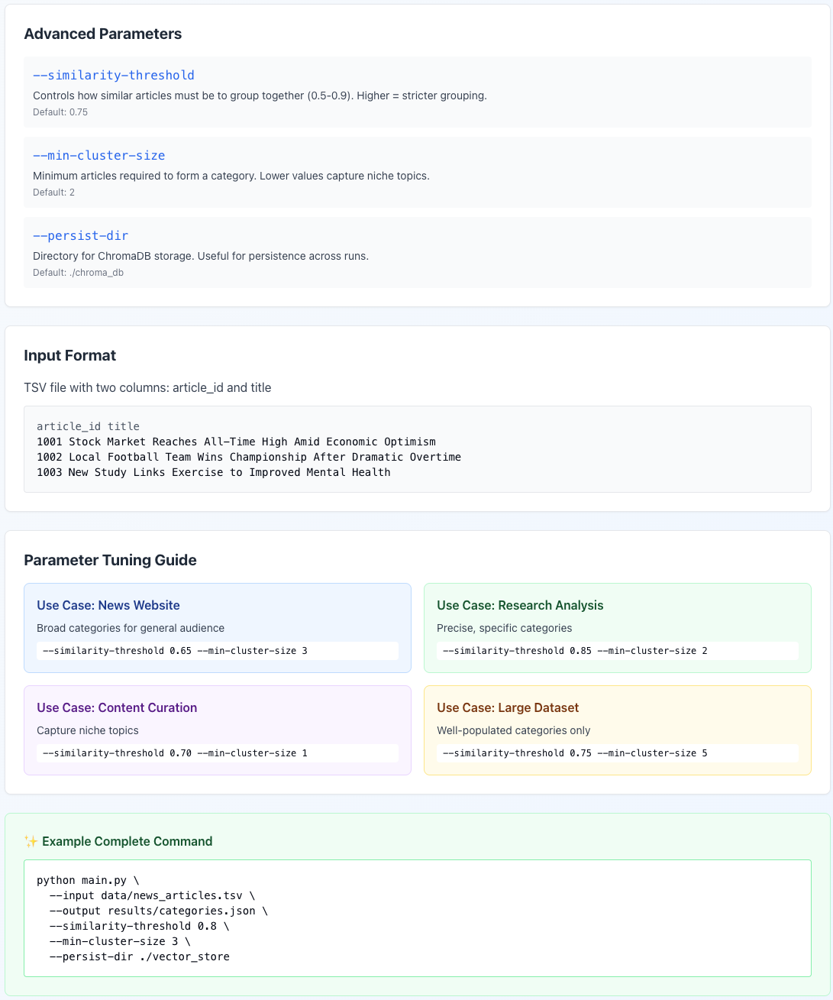

# Preface
## Vibe coding process
1. Create a prompt to create a prompt. E.g. Create a prompt for an LLM that instructs it to do this ...
Prompt LLMs on [LM Arena](https://lmarena.ai/) in side by side battle mode to create a prompt that will do what I want.
In this case it was .
2. Use the generated  as the prompt to generate the actual code.
Which produced [Claude artifact](https://claude.ai/public/artifacts/7dcd1546-4e30-4344-bfc9-e92be72ea72e).
3. Vibe fix code by feeding errors.
This needed 2 main fixes, both to categorizer.py.
These were fixed using [Kimi K2](https://www.kimi.com/en/).

1. imports were missing

```python
import logging
import numpy as np
import pandas as pd
from typing import Dict
from typing import List
from sklearn.cluster import DBSCAN
from sklearn.feature_extraction.text import TfidfVectorizer
```
2. Convert numpy ints to Python ints in format_results()

This is different than the one in the Claude Artifact link

```python
def format_results(
    categories: Dict[int, Dict],
    articles: pd.DataFrame,
    cluster_labels: np.ndarray
) -> Dict:
    """
    Format clustering results for output.
    
    Args:
        categories: Dictionary of category information
        articles: DataFrame with article data
        cluster_labels: Array of cluster assignments
        
    Returns:
        Formatted results dictionary
    """
    results = {
        'categories': {},
        'uncategorized': []
    }
    
    # Add categorized articles
    for cat_id, cat_info in categories.items():
        article_list = []
        for idx in cat_info['article_indices']:
            article_list.append({
                'article_id': str(articles.iloc[idx]['article_id']),
                'title': articles.iloc[idx]['title']
            })
        
        # Convert cat_id to int() to ensure it's a Python int, not numpy.int64
        display_id = int(cat_id) + 1  # 1-indexed for display
        
        results['categories'][display_id] = {
            'category_id': display_id,
            'category_name': cat_info['category_name'],
            'article_count': len(article_list),
            'articles': article_list
        }
    
    # Add uncategorized articles
    uncategorized_mask = cluster_labels == -1
    uncategorized_articles = articles[uncategorized_mask]
    
    for _, row in uncategorized_articles.iterrows():
        results['uncategorized'].append({
            'article_id': str(row['article_id']),
            'title': row['title']
        })
    
    return results
```

# Claude Artifact embed code

```html
<iframe src="https://claude.site/public/artifacts/7dcd1546-4e30-4344-bfc9-e92be72ea72e/embed" title="Claude Artifact" width="100%" height="600" frameborder="0" allow="clipboard-write" allowfullscreen></iframe>
```

and that's it, Folks!
We now return you to your regularly scheduled repo ...

---

# News Article Categorization System

Automatically categorize news articles using semantic similarity and vector embeddings.

## Features

- Semantic article clustering using sentence embeddings
- ChromaDB vector storage for efficient similarity search
- DBSCAN clustering for automatic category discovery
- Keyword-based category naming
- JSON export for integration with other systems

## Installation

```bash
# Create virtual environment
python -m venv venv
source venv/bin/activate  # On Windows: venv\Scripts\activate

# Install dependencies
pip install -r requirements.txt
```

## Usage

### Basic Usage

```bash
python main.py --input articles.tsv --output categories.json
```

### Advanced Options

```bash
python main.py \
  --input articles.tsv \
  --output categories.json \
  --min-cluster-size 3 \
  --similarity-threshold 0.8 \
  --persist-dir ./my_chroma_db
```

### Parameters

- `--input`: Path to TSV file with article_id and title columns (required)
- `--output`: Output JSON file path (default: categories.json)
- `--min-cluster-size`: Minimum articles per category (default: 2)
- `--similarity-threshold`: Cosine similarity threshold 0-1 (default: 0.75)
- `--persist-dir`: ChromaDB storage directory (default: ./chroma_db)

## Input Format

TSV file with header row:

```
article_id	title
1001	Stock Market Reaches All-Time High
1002	Local Team Wins Championship
```

## Output Format

JSON file with categorized articles:

```json
{
  "categories": [
    {
      "category_id": 1,
      "category_name": "Business/Finance",
      "article_count": 2,
      "articles": [...]
    }
  ],
  "uncategorized": [...]
}
```

## Parameter Tuning

### Similarity Threshold (0.5 - 0.9)
- **Higher (0.8-0.9)**: Stricter grouping, more specific categories
- **Lower (0.5-0.7)**: Broader categories, fewer uncategorized articles

### Min Cluster Size
- **Higher values**: Only create well-populated categories
- **Lower values**: Capture niche topics

## Architecture

- `main.py`: CLI interface and workflow orchestration
- `embeddings.py`: Sentence transformer embedding generation
- `chroma_manager.py`: Vector database operations
- `categorizer.py`: DBSCAN clustering and naming
- `file_handler.py`: I/O operations
- `config.py`: Configuration constants

## Troubleshooting

**Model download fails**: Ensure internet connection for first run
**ChromaDB errors**: Delete ./chroma_db directory and retry
**Empty categories**: Lower similarity threshold or min cluster size


