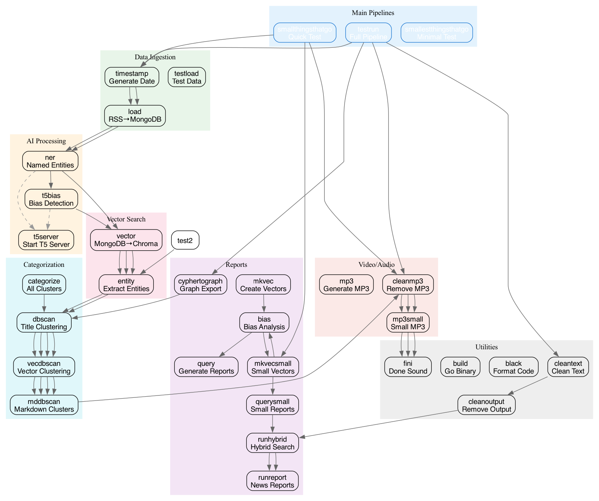

# Makefile Reference

Complete reference for all Makefile targets in the propaganda project.

## Pipeline Graph



## Quick Reference

| Target | Description |
|--------|-------------|
| `make testrun` | Full pipeline (timestamp → fini) |
| `make smallthingsthatgo` | Quick test pipeline |
| `make smallestthingsthatgo` | Minimal test pipeline |

---

## Main Pipelines

### testrun
Full end-to-end pipeline: `timestamp → load → ner → t5bias → vector → entity → cleantext → cleanoutput → runhybrid → runreport → cyphertograph → dbscan → vecdbscan → mddbscan → cleanmp3 → mp3small → fini`

### smallthingsthatgo
Quick test pipeline: `timestamp → load → ner → vector → entity → mkvecsmall → bias → mkvecsmall → querysmall → cleanmp3 → mp3small → fini`

### smallestthingsthatgo
Minimal test (no output cleanup): `timestamp → load → ner → vector → entity → mkvecsmallest → bias → mkvecsmallest → querysmallest → mp3small → fini`

---

## Individual Targets

### Data Ingestion

#### load
Read RSS feeds from `config/big.tsv` and load into MongoDB using the Go binary. Runs deduplication.

```bash
make load
```
- Runs `./propaganda config/big.tsv config/kill.tsv`
- Runs `db/dedupe.py` to remove duplicates
- Requires: MongoDB running

#### testload
Load test data (smaller feed set) for testing.

```bash
make testload
```
- Runs `./propaganda config/test.tsv config/kill.tsv`

---

### Timestamp & Date

#### timestamp
Generate timestamp file for pipeline. Uses `TIMESTAMP_OFFSET` (default: 3 days ago).

```bash
make timestamp
```
- Runs `db/mktimestamp.py 3`
- Output: `db/timestamp.txt` with ISO date

---

### Named Entity Recognition

#### ner
Extract named entities from articles using Flair NER service.

```bash
make ner
```
- Runs `cd ../ner && ./RUNME.sh $(NUMDAYS)`
- Requires: NER service running on port 8100
- Input: Articles from MongoDB since `NUMDAYS`
- Output: `ner` field in MongoDB articles

---

### T5 Bias Detection

#### t5bias
Run bias detection on articles using T5 model via bias processor.

```bash
make t5bias
```
- Runs `llm/bias_processor.py --start-date $(NUMDAYS)`
- Requires: T5 server running on port 1337
- Input: Articles from MongoDB since `NUMDAYS`
- Output: `bias` field in MongoDB articles

#### t5server
Start the T5 bias detection server (MPS/CUDA).

```bash
make t5server
```
- Runs `source t5/.venv/bin/activate && cd t5 && ./server_mps.py`
- Starts FastAPI server on port 1337

---

### Vector Search

#### vector
Load articles into ChromaDB vector database.

```bash
make vector
```
- Runs `db/mongo2chroma.py load --start-date $(NUMDAYS) --force`
- Input: MongoDB articles since `NUMDAYS`
- Output: Vectors in ChromaDB

---

### Entity Extraction

#### entity
Extract entity lists from MongoDB.

```bash
make entity
```
- Creates `output/titles.tsv` — Article IDs and titles
- Creates `output/titles_nohindu.tsv` — Filtered titles (excludes thehindu, indiaexpress)
- Creates `output/impentity.tsv` — Important entities (PERSON, GPE, LOC, EVENT) for last 3 days
- Creates `output/entity.tsv` — All entities for last 3 days
- Creates `output/entity_60days.tsv` — All entities for last 60 days
- Creates `output/impentity_60days.tsv` — Important entities for last 60 days

---

### Report Generation

#### mkvec
Create vector files for all entities in batch mode (full cleanup).

```bash
make mkvec
```
- Deletes existing `*.vec` and `*.ids` files
- Runs `db/runmkvecbatch.sh` for all entities
- Creates `db/ids.txt` with unique article IDs

#### mkvecsmall
Create vector files with smaller batch queries.

```bash
make mkvecsmall
```
- Deletes `*.md`, `*.txt`, `*.vec`, `*.tsv`, `*.ids`, `*.cypher`, `*.reporter`
- Runs `db/batchquery.sh` with `mkvec.sh` script
- Creates `db/ids.txt`

#### mkvecsmallest
Create vector files with minimal cleanup (reuses existing).

```bash
make mkvecsmallest
```
- Runs `db/batchquerysmallest.sh` with `mkvec.sh` script
- Faster than mkvecsmall (no cleanup step)

#### bias
Run bias detection via geminize on extracted IDs.

```bash
make bias
```
- Runs `db/runbias.sh` which processes `db/ids.txt`
- Uses LLM to analyze bias

#### query
Generate reports for all entities in batch.

```bash
make query
```
- Deletes `*.md`, `*.txt`, `*.cypher`, `*.reporter` files
- Runs `db/runentitybatch.sh` for all entities

#### querysmall
Generate smaller batch of reports.

```bash
make querysmall
```
- Runs `db/batchquery.sh` with `report.py` script

#### querysmallest
Generate minimal batch of reports (fastest).

```bash
make querysmallest
```
- Runs `db/batchquerysmallest.sh` with `report.py` script

---

### Hybrid Search

#### runhybrid
Run hybrid vector search for all batch entities.

```bash
make runhybrid
```
- Runs `db/runhybrid.py hybrid_batch.tsv`
- Creates `output/*.vec` files for each entity

#### runreport
Generate news reports for all batch entities.

```bash
make runreport
```
- Runs `db/runreport.py hybrid_batch.tsv`
- Creates `output/*.md` reports for each entity

#### cyphertograph
Convert cypher output to graph format.

```bash
make cyphertograph
```
- Runs `db/cypher_to_graph.py`

---

### Categorization

#### categorize
Categorize articles using DBSCAN clustering.

```bash
make categorize
```
- Runs: `entity → dbscan → vecdbscan → mddbscan`
- Creates category clusters from titles and vectors

#### dbscan
Cluster article titles using DBSCAN.

```bash
make dbscan
```
- Creates `output/titles_dbscan.tsv`
- Runs `dbscan/main.py` to cluster

#### vecdbscan
Convert clusters to vectors.

```bash
make vecdbscan
```
- Converts categories to vectors
- Creates `db/cluster/ids.txt`

#### mddbscan
Convert clusters to markdown reports.

```bash
make mddbscan
```
- Creates `db/cluster/*.md` files

---

### Text Cleaning

#### cleantext
Clean article text using regex rules.

```bash
make cleantext
```
- Runs `db/clean_article_text.py`
- Removes one-word lines and double newlines

---

### Video Generation

#### mp3
Generate MP3 audio from articles (full cleanup).

```bash
make mp3
```
- Deletes existing MP3s in `mp3/mp3/`
- Runs `mp3/mkmkbatch.sh` to create batch
- Runs `mp3/batch.sh` with Kokoro TTS

#### mp3small
Generate MP3 audio without cleanup.

```bash
make mp3small
```
- Runs `mp3/mkmkbatch.sh`
- Runs `mp3/batch.sh` with Kokoro TTS

#### cleanmp3
Remove all generated MP3 files.

```bash
make cleanmp3
```
- Runs `find mp3/mp3 -name '*.mp3' -delete`

---

### Cleanup

#### cleanoutput
Remove all output files.

```bash
make cleanoutput
```
- Runs `rm -rf db/output/*`

---

### Build & Dev

#### build
Build the Go binary.

```bash
make build
```
- Runs `go build`
- Creates `./propaganda` binary

#### back
Start the backend API server.

```bash
make back
```
- Runs `back/RUNME.sh`

#### front
Start the frontend web interface.

```bash
make front
```
- Runs `front/RUNME.sh`

#### black
Format Python code with black.

```bash
make black
```
- Runs `black db/*.py`
- Runs `black ner/*.py`

#### mgconsole
Start Memgraph CLI console.

```bash
make mgconsole
```
- Runs Docker container: `memgraph/mgconsole`

---

### Notification

#### fini
Play completion sound and speak message.

```bash
make fini
```
- Plays: `~/Music/df picking up man.wav`
- Speaks: "The news has been loaded, Doctor!"

---

## Legacy Targets

### oldthingsthatgo
```bash
make oldthingsthatgo
# entity → mkvecsmall → bias → mkvecsmall → querysmall → cleanmp3 → mp3small → fini
```

### thingsthatgo
```bash
make thingsthatgo
# load → ner → vector → entity → mkvec → bias → query → mp3 → fini
```

### test2
```bash
make test2
# entity → dbscan → vecdbscan → mddbscan → cleanmp3 → mp3small → fini
```

### fquerymp3, fvector, fload, fner, etc.
Various focused pipelines for specific tasks.

---

## Variable Reference

| Variable | Default | Description |
|----------|---------|-------------|
| `DB_ENV` | `db/.venv` | Python virtual environment |
| `CONDA_MP3_ENV` | `kokoro` | Conda environment for TTS |
| `TITLEFILE` | `output/titles.tsv` | Title output file |
| `NUMDAYS` | From `db/timestamp.txt` or today | Date range for processing |
| `TIMESTAMP_OFFSET` | `3` | Days ago for timestamp |

---

## Examples

```bash
# Full pipeline
make testrun

# Quick test (faster)
make smallthingsthatgo

# Just vector search
make vector

# Just generate reports
make querysmall

# Just video
make mp3small

# Run specific entity
make runhybrid
```